# /bl
This repository contains code relevant to a my projects shown at https://geobica.com/bl/.

### Of the 19 listed on my page, these 3 are the ones that link to a repository here:
<table>
  <tr>
    <td>
      <a class="link" href="https://github.com/geobica/bl/tree/main/mdc">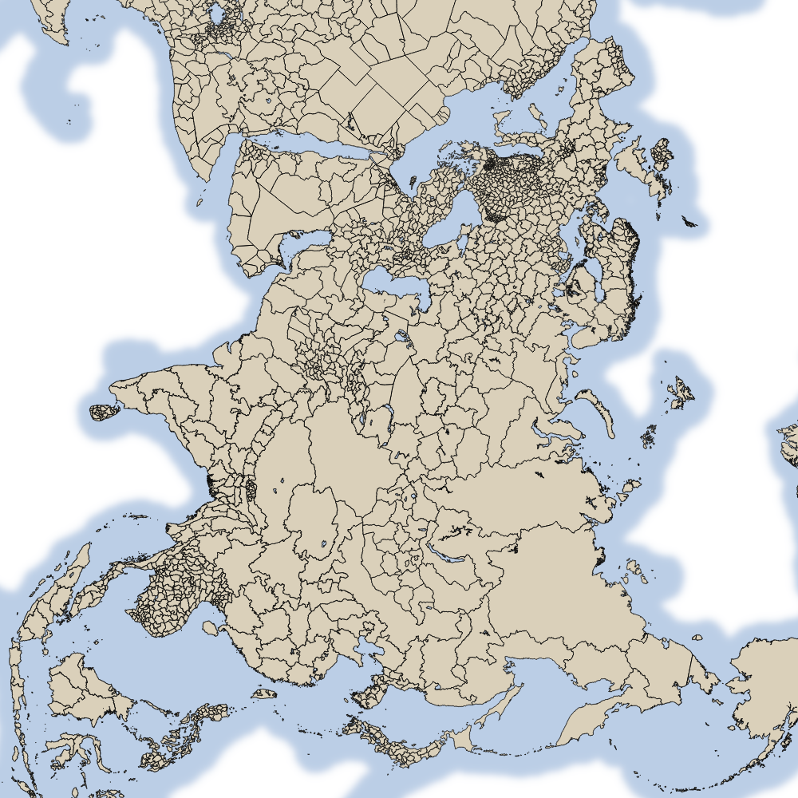</a>
        <h5><a class="link" href="https://github.com/geobica/bl/tree/main/mdc">Minimizing Scale Distortion in Conformal Projections</a> (<a class="link" href="https://geobica.com/bl/mdc">article</a>)</h5>
      A method for creating conformal map projections with minimal possible distortion of scale within a designated region.
    </td>
    <td>
      <a class="link" href="https://github.com/geobica/bl/tree/main/cfc">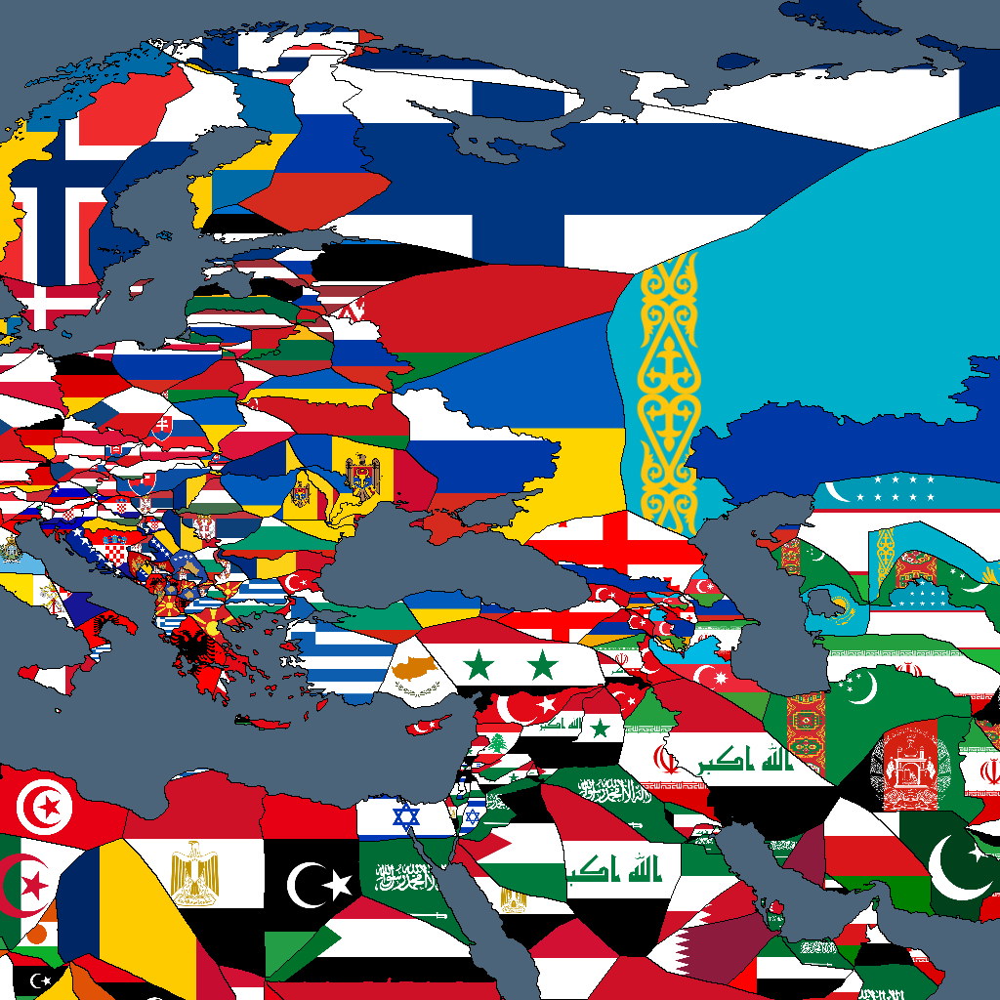</a>
        <h5><a class="link" href="https://github.com/geobica/bl/tree/main/cfc">The Closest Foreign Country</a> (<a class="link" href="https://geobica.com/bl/cfc">article</a>)</h5>
      What is the closest foreign country to any given point on land?
    </td>
  </tr>
<tr>
    <td>
      <a class="link" href="https://github.com/geobica/bl/tree/main/ssl">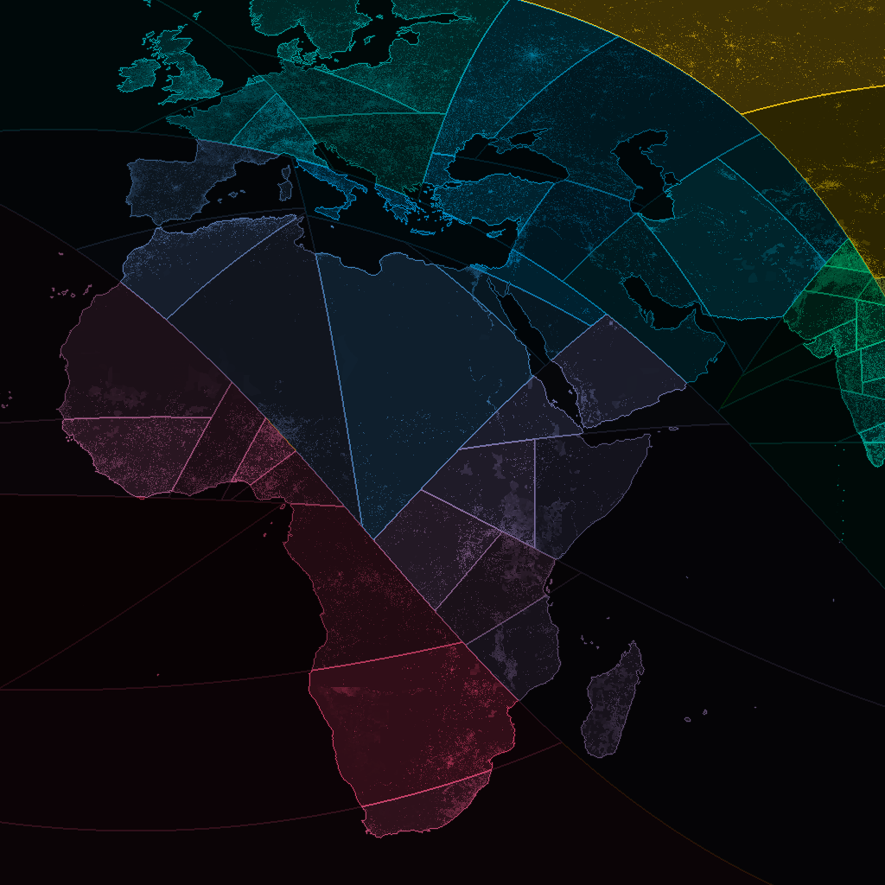</a>
        <h5><a class="link" href="https://github.com/geobica/bl/tree/main/ssl">Applying the Shortest Splitline Algorithm to the World</a> (<a class="link" href="https://geobica.com/bl/ssl">article</a>)</h5>
      Dividing the world into regions of equal population using the shortest splitline algorithm of voter districting.
    </td>
</tr>
</table>

### These projects feature interactive elements with js code involved: 
<table>
<tr>
    <td>
      
        <h5><a class="link" href="https://github.com/geobica/bl/tree/main/fwc">Flags with Constellations</a> (<a class="link" href="https://geobica.com/bl/fwc">article</a>)</h5>
      An overview of flags with constellations on them and a tool for editing them.
    </td>
    <td>
      <a class="link" href="https://github.com/geobica/bl/tree/main/msc">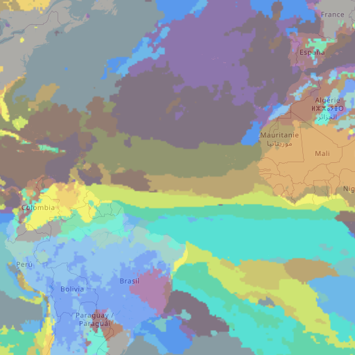</a>
        <h5><a class="link" href="https://github.com/geobica/bl/tree/main/msc">Mapping Seasons Across Climates</a> (<a class="link" href="https://geobica.com/bl/msc">article</a>)</h5>
      An interactive map tool you can use to look at precipitation and temperature patterns around the world.
    </td>
</tr>
<tr>
    <td>
      <a class="link" href="https://github.com/geobica/bl/tree/main/scs">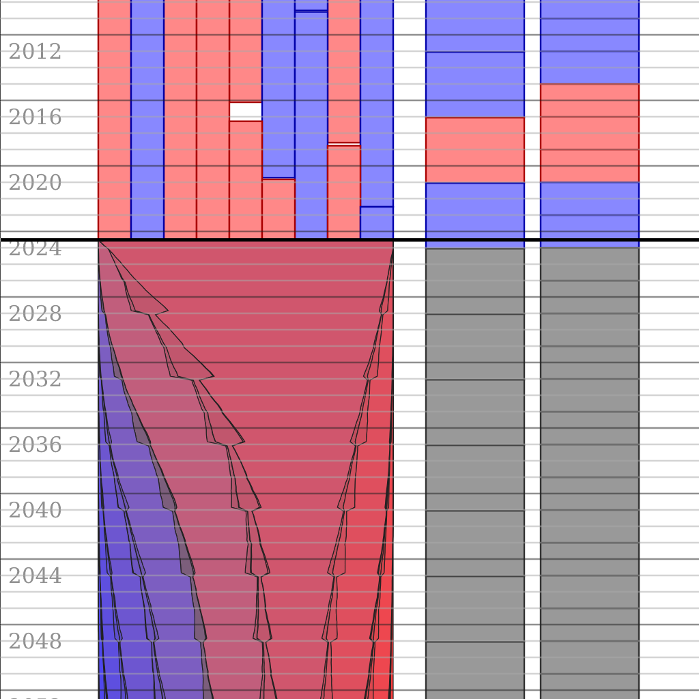</a>
        <h5><a class="link" href="https://github.com/geobica/bl/tree/main/scs">How long will the US Supreme Court lean conservative?</a> (<a class="link" href="https://geobica.com/bl/scs">article</a>)</h5>
      A statistical model of how the ideological lean of the Supreme Court might evolve over the next few decades.
    </td>
    <td>
      
        <h5><a class="link" href="https://github.com/geobica/bl/tree/main/tcc">The Card Calendar</a> (<a class="link" href="https://geobica.com/bl/tcc">article</a>)</h5>
      A calendar where the 52 weeks of the year are sorted into a deck of 4 seasons.
    </td>
<tr>
    <td>
      
        <h5><a class="link" href="https://github.com/geobica/bl/tree/main/atn">List of Integers</a> (<a class="link" href="https://geobica.com/bl/atn">article</a>)</h5>
      In alphabetical order.
    </td>
  </tr>
    <td>
      
        <h5><a class="link" href="https://github.com/geobica/bl/tree/main/usf">The Future of the American Flag</a> (<a class="link" href="https://geobica.com/bl/usf">article</a>)</h5>
      How the stars on the flag might be arranged if new states ever join the union.
    </td>
</tr>
</table>

### These projects do not involve as much code but are still be interesting:
<table>
  <tr>
    <td>
      <a class="link" href="https://github.com/geobica/bl/tree/main/vtc">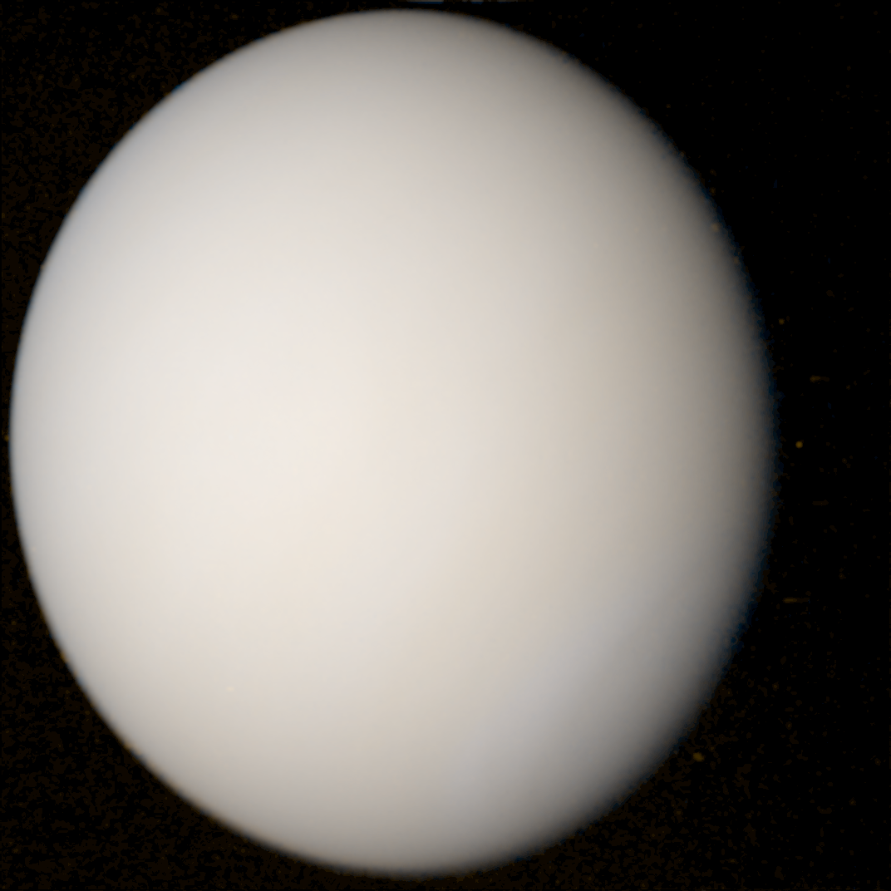</a>
        <h5><a class="link" href="https://github.com/geobica/bl/tree/main/vtc">Venus in True Color</a> (<a class="link" href="https://geobica.com/bl/vtc">article</a>)</h5>
      An exploration of how images of Venus have been created, which depiction is the most accurate, and if I can create one that I know for sure is accurate.
    </td>
    <td>
      <a class="link" href="https://github.com/geobica/bl/tree/main/pmt">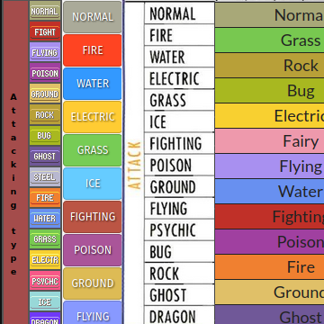</a>
        <h5><a class="link" href="https://github.com/geobica/bl/tree/main/pmt">Ordering the Pok&#233;mon Types</a> (<a class="link" href="https://geobica.com/bl/pmt">article</a>)</h5>
      In which I attempt to figure out whether there's a &quot;canonical&quot; ordering of the types in Pok&#233;mon.
    </td>
  </tr>
<tr>
    <td>
      
        <h5><a class="link" href="https://github.com/geobica/bl/tree/main/kdw">What is the karmic driven world of Earl?</a> (<a class="link" href="https://geobica.com/bl/kdw">article</a>)</h5>
      A look at a bizarre autotranslation mystery.
    </td>
    <td>
      <a class="link" href="https://github.com/geobica/bl/tree/main/ard">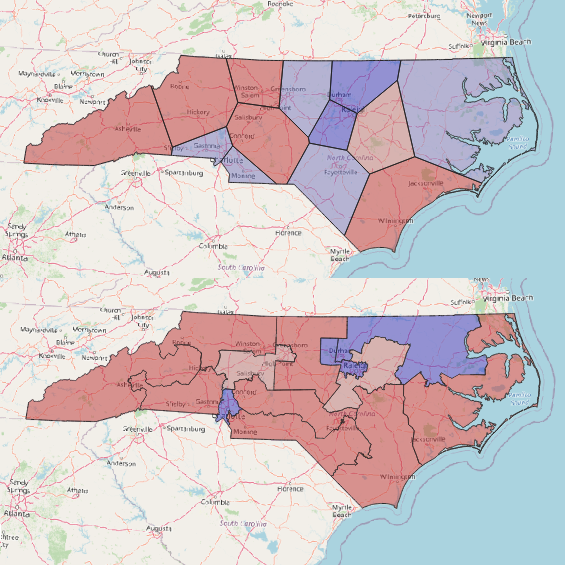</a>
        <h5><a class="link" href="https://github.com/geobica/bl/tree/main/ard">Could algorithmic redistricting prevent gerrymandering?</a> (<a class="link" href="https://geobica.com/bl/ard">article</a>)</h5>
      Some calculations I've done about how algorithmic redistricting done with balanced centroidal power diagrams would impact state house and federal congressional elections.
    </td>
  </tr>
<tr>
    <td>
      <a class="link" href="https://github.com/geobica/bl/tree/main/ofm">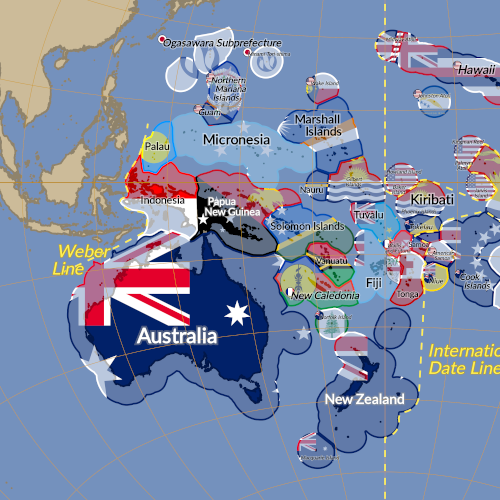</a>
        <h5><a class="link" href="https://github.com/geobica/bl/tree/main/ofm">Oceania Flag Map</a> (<a class="link" href="https://geobica.com/bl/ofm">article</a>)</h5>
      Maps of Oceania that show its flags and how its population is distributed.
    </td>
    <td>
      <a class="link" href="https://github.com/geobica/bl/tree/main/dzg">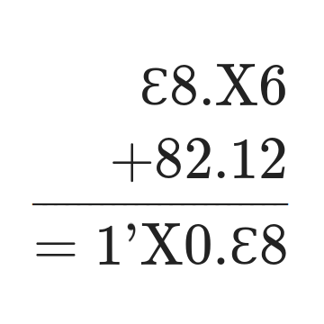</a>
        <h5><a class="link" href="https://github.com/geobica/bl/tree/main/dzg">Dozagesimal Ponderances</a> (<a class="link" href="https://geobica.com/bl/dzg">article</a>)</h5>
      Some thoughts on the practicality of base-120, notation for it, and more related numbering systems.
    </td>
  </tr>
<tr>
    <td>
      <a class="link" href="https://github.com/geobica/bl/tree/main/a4r">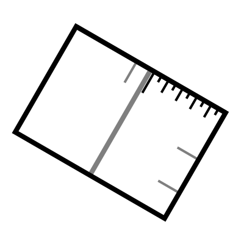</a>
        <h5><a class="link" href="https://github.com/geobica/bl/tree/main/a4r">How to Fold a Ruler from A4 Paper</a> (<a class="link" href="https://geobica.com/bl/a4r">article</a>)</h5>
      Deriving a metric ruler from the properties of A4 paper.
    </td>
    <td>
      <a class="link" href="https://github.com/geobica/bl/tree/main/hmd">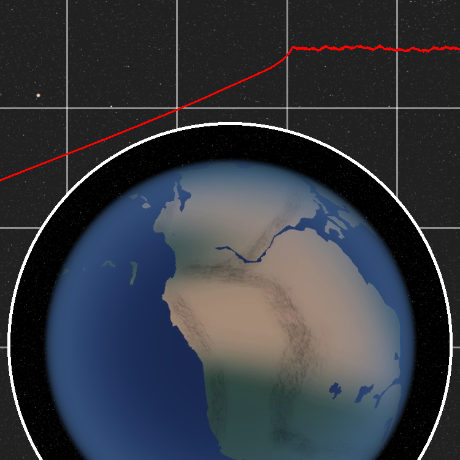</a>
        <h5><a class="link" href="https://github.com/geobica/bl/tree/main/hmd">How many days have there been?</a> (<a class="link" href="https://geobica.com/bl/hmd">article</a>)</h5>
      How many times has the Earth rotated in its four billion year history?
    </td>
  </tr>
<tr>
    <td>
      
        <h5><a class="link" href="https://github.com/geobica/bl/tree/main/asa">The Animated States of America</a> (<a class="link" href="https://geobica.com/bl/asa">article</a>)</h5>
      An animation of every state's flag, along with the territories and DC.
    </td>
    <td>
      <a class="link" href="https://github.com/geobica/bl/tree/main/igp">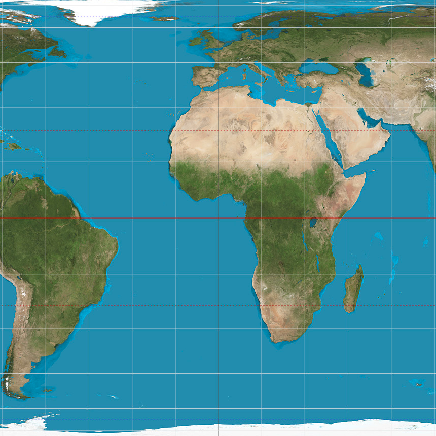</a>
        <h5><a class="link" href="https://github.com/geobica/bl/tree/main/igp">Improving Gall-Peters</a> (<a class="link" href="https://geobica.com/bl/igp">article</a>)</h5>
      On why the Gall-Peters map is suboptimal and should not be used.
    </td>
  </tr>
<tr>
    <td>
      <a class="link" href="https://github.com/geobica/bl/tree/main/spf">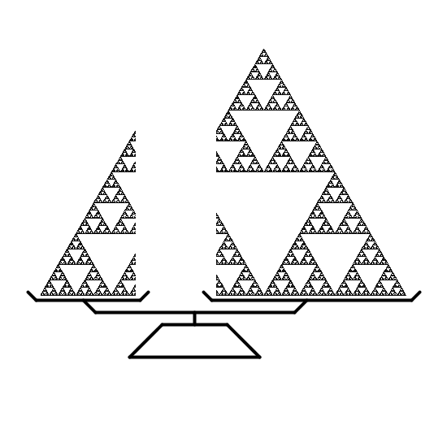</a>
        <h5><a class="link" href="https://github.com/geobica/bl/tree/main/spf">Splitting Fractals</a> (<a class="link" href="https://geobica.com/bl/spf">article</a>)</h5>
      An analysis of the mass of slices of basic fractals taken at rational intervals.
    </td>
</tr>
</table>

 
Other projects found in this repository are unfinished and have not yet been published as articles.
        
