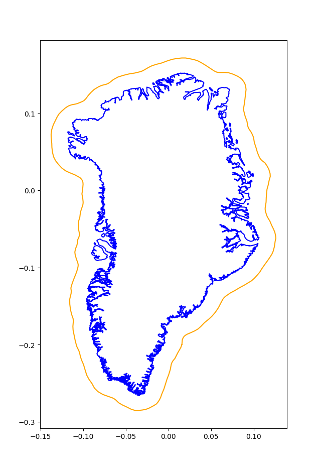
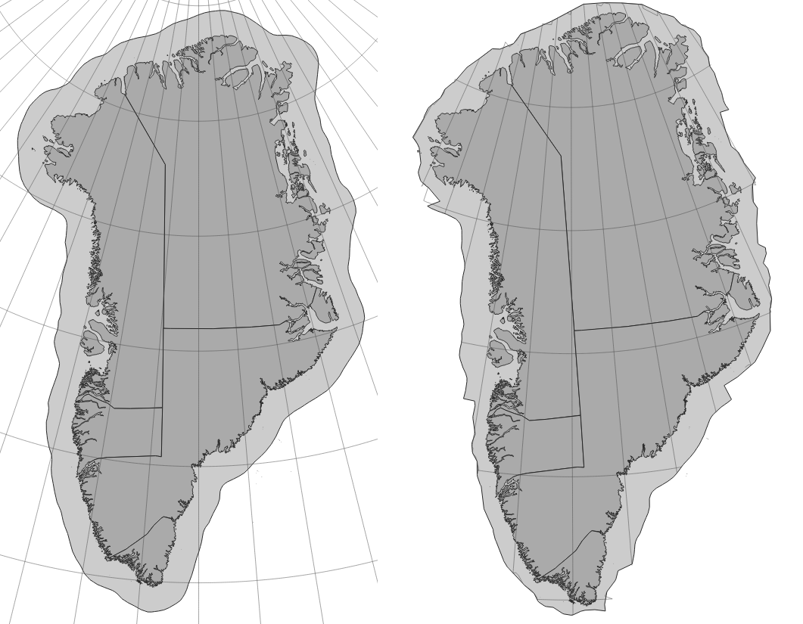

# Minimizing Scale Distortion in Conformal Projections
This code implements an algorithm which generates a map projection optimized for a given region, such that it is conformal within that region and has a consistant scale along the region's boundary.

The math of the algorithm is explained on [my blog](https://www.geobica.com/bl/mdc/). To implement the Schwarz-Christoffel mapping needed for the computation, I used Toby Driscoll's [Schwarz–Christoffel Toolbox](https://tobydriscoll.net/project/sc-toolbox/), which was ported from MATLAB to GNU Octave by [Joseph Malkoun](https://github.com/joemalk/sc_toolbox_octave).
 
Three python files are used to implement the projection algorithm:
1. `bubble_wrap.py`
	- Calculates a boundary around a given region with a smoothed exterior that includes any extraneous polygons.
2. `geobica_projection.py`
	- Takes this boundary and numerically implements the projection algorithm to generate the corresponding positions of sample points in a stereographic projection and the optimized conformal projection (W and M respectively).
3. `interpolate.py`
	- Uses these sample points to project a given shapefile to the generated projection via Clough Tocher 2D interpolation.

## bubble_wrap.py

Given a geopackage in the folder `input_sample/`, such as the map of Greenland provided at `input_sample/greenland.gpkg`, this script can be used to compute a polygon W with enough buffer space to allow the projection algorithm to work. The map given, as well as any map that will later be given to be reprojected, should be in an equirectangular projection (EPSG:4326). Conversion to stereographic in preparation for reprojection to the optimized projection, will be done by my code.

As an example, this script could be used by running:
```
python bubble_wrap.py greenland -40 75
```
Where "greenland" is the name of the file in the `input_sample/` folder, and -40 and 75 are the longitude and latitude in degrees of a point contained in the region. These points should be approximately central to the region, but importantly, the point opposite to them on the globe (in this case 140°E 75°S) must be outside the region.

The generated polygon W and the given centerpoint will be stored at `pickle/bubble_wrap/[NAME]_full_wrapping.txt`, where `[NAME]` is the name given to the aforementioned region, in this case `greenland`.

The image below shows the stereographic projection of Greenland in blue, with the polygon W in orange: 


## geobica_projection.py

This algorithm uses the polygon in `pickle/bubble_wrap/` to calculate a numerical implementation of the optimal conformal projection for that region.

As an example, this script could be used by running:
```
python geobica_projection.py greenland
```
It can take several minutes to run for a small region, and approximately an hour for large complex regions, so save states are stored in `pickle/matlab_saves/`. These can be used when rerunning the code by adding the level number of the last matlab data save generated. For example, if `greenland_level_5.mat` has been generated, you could run `python geobica_projection.py greenland 5` to continue the algorithm from there. Each level corresponds to a layer of the heptagonal lattice away from the center given, as described in my blog post.

Once complete, the sample points locations will be stored at `pickle/interpolation_points/[NAME]_W.npy` and `pickle/interpolation_points/[NAME]_M.npy`, for the points in the stereographic projection and the new projection respectively.

## interpolate.py

Given a geopackage that you want to reproject, such as `maps_to_project/greenland_detail.gpkg` given as an example, the computed sample points for `greenland` could be used by running:
```
python interpolate.py greenland maps_to_project/greenland_detail.gpkg
```
The input file should be in an equirectangular projection (EPSG:4326). Six new shapefiles will be created:
+ Three in a stereographic projection centered on the originally given center:
	- `original_[NAME].shp` (projection of the geopackage given to `interpolate.py`)
	- `original_outline_[NAME].shp` (the polygon W)
	- `original_gridline_[NAME].shp` (a grid of latitude and longitude lines)
+ Three in the optimized projection:
	- `[NAME].shp` (projection of the geopackage given to `interpolate.py`)
	- `outline_[NAME].shp` (the polygon M)
	- `gridline_[NAME].shp` (a grid of latitude and longitude lines)

Below on the left are the outputted shapefiles for Greenland in the stereographic projection, with the optimized projection on the right. The `greenland_detail` geopackage includes the boundaries of Greenland's 5 municipalities, so they are shown in the output here.

At the edge of the shapes outlines in the optimized projection there is significant error, due to the way in which the interpolation works, but for the area inside Greenland this distortion does not occur. In the future, I hope to be able to refine the way this algorithm approximates projection of points on the boundary of W. When attempting to project points outside of W, the interpolation algorithm will resort to a nearest points interpolation algorithm, as it is generally not possible to continue these projections beyond the boundary polygon in a way that maintains their conformality.