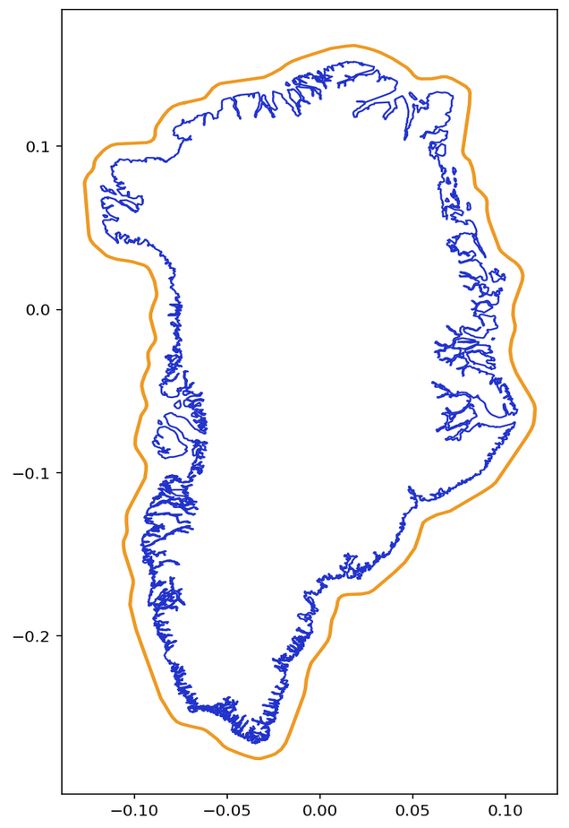
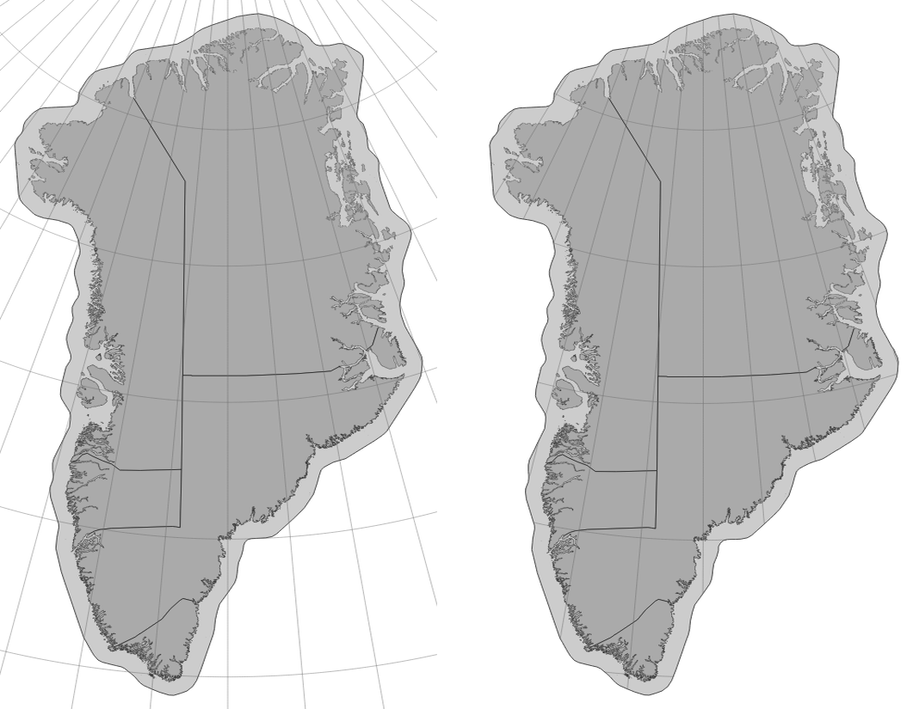

# Minimizing Scale Distortion in Conformal Projections
This code implements an algorithm which generates a map projection optimized for a given region, such that it is conformal within that region and has a consistant scale along the region's boundary.

The math of the algorithm is explained on [my blog](https://www.geobica.com/bl/mdc/). To implement the Schwarz-Christoffel mapping needed for the computation, I used Toby Driscoll's [Schwarz–Christoffel Toolbox](https://tobydriscoll.net/project/sc-toolbox/), which was ported from MATLAB to GNU Octave by [Joseph Malkoun](https://github.com/joemalk/sc_toolbox_octave).
 
Three python files are used to implement the projection algorithm:
1. `bubble_wrap.py`
	- Calculates a boundary around a given region with a smoothed exterior that includes any extraneous polygons.
2. `geobica_projection.py`
	- Takes this boundary and numerically implements the projection algorithm to generate the corresponding positions of sample points in a stereographic projection and the optimized conformal projection (W and M respectively).
3. `interpolate.py`
	- Uses these sample points to project a given shapefile to the generated projection via a piecewise linear interpolation on each
     triangle in a Delaunay triangulation performed on the mesh points found through Schwarz-Christoffel mapping, with slight adjustments
     made after to correct minor precision errors.

## How to Use this Tool

In the new August 2026 version of this tool, the only script you need to run to create and use a projection is:
```
python geobica_projection.py
```

This will open a TUI menu in which you can select a projection to use, or create a new projection, and then select a shapefile that you
 want to project.

In the First Menu, you can either select a precomputed projection, or pick a boundary to use as W in the calculation of a new optimized projection out of the shapefiles in `boundary_polygons/`, or select the `New Boundary` option to run the `bubble_wrap.py` script on a potentially more complicated set of shapes and get a usable boundary around it.

If you pick to create a New Boundary for `greenland`, for instance, it will use the file at `input_sample/greenland.gpkg` and find a boundary that goes around it with somewhat of a buffer as can be seen in the image below, showing the stereographic projection of Greenland in blue, with the polygon W in orange:


The boundary W found by the bubble_wrap algorithm will be added to `boundary_polygons/` and will from then on be selectable in the First Menu as a boundary to use without having to repeat the bubble_wrap step.

## Second Menu

After the projection has been computed, the user has the option to select a shapefile to project into the desired projection. To add your own shapefile to this list, put it in `maps_to_project/`.

The chosen file should be in an equirectangular projection (EPSG:4326). Three new shapefiles will be created in the optimized projection:
+ `projection_[NAME]_[SHAPEFILE].shp` (projection of the shapefile `[SHAPEFILE]` selected in the second menu)
+ `boundary_[NAME].shp` (the polygon M)
+ `mesh_[NAME].shp` (the analytically calculated points used to define the triangulation)

Below on the left are the outputted shapefiles for Greenland in the stereographic projection, with the optimized projection on the right. The `greenland_detail` geopackage includes the boundaries of Greenland's 5 municipalities, so they are shown in the output here. This projection was computed using the old version of the tool, so the boundary visibly has more error than it should now:

At the edge of the shapes outlines in the optimized projection there was significant error introduced in the original version of this tool, due to the way in which the interpolation works, but for the area inside Greenland this distortion does not occur. In the future, I hope to be able to refine the way this algorithm approximates projection of points on the boundary of W through a more robust analytic method, rather than through interpolation. When attempting to project points outside of W, the interpolation algorithm will fall back on the linear transformation of the nearest triangle in the triangulation to the point, as it is generally not possible to continue the pure Schwarz-Christoffel projections beyond the boundary polygon in a way that maintains their conformality.